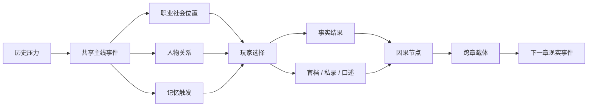

# 《山河无名》项目总框架 V0.3

> 文档状态：当前最高层叙事规范
>
> 版本定位：在 V0.2 母题与章节方向不变的基础上，补全单章时间窗口、玩家体验、系统闭环、跨章交接和第一章至第二章接口。
>
> 核心母题：无名不是没有名字。无名的名字，是人民。

## 0. V0.3 解决了什么

V0.2 已经确定苏醒者、跨朝代因果和“从无名者到人民”的终极方向，但随着第一章主线、人物、职业、因果和记忆文档完成，出现了几个必须由总纲统一解决的问题：

1. “每章是一段完整人生”与“每章覆盖数百年朝代史”互相冲突。
2. 朝代章节有主题，却没有明确的可亲历历史窗口。
3. 玩家能够改变什么、不能改变什么，尚未成为全项目统一规则。
4. 职业、人物、因果、记忆已经分别成形，但总纲没有说明它们如何共同驱动一场选择。
5. 跨章因果有表格，却缺少统一的“交接包”与过渡场景标准。
6. 第一章结束于统一，第二章开始于统一之后，但缺少一段真正把人物、制度和记忆同时送过去的桥。

V0.3 不改变终极母题，而是把已有理念收束为一套能够继续写作和开发的项目结构。

## 1. 项目本质

### 1.1 核心一句话

一个不知来处的苏醒者，在中国历史的关键转折处一次次醒来，每一世都成为时代中的普通人；他起初寻找自己的名字，最终发现自己是千千万万无名者共同的历史回声。

### 1.2 类型

| 项目维度 | 定义 |
|---|---|
| 叙事类型 | 中国历史长河、轮回人生、普通人视角、跨章因果 |
| 玩法类型 | 文字选择、关系变化、社会位置、有限资源、轻策略 |
| 核心体验 | 在不可由个人改写的历史大势中，决定怎样活、怎样承担、怎样留下记录 |
| 长线动力 | 寻找苏醒者身份、追踪跨朝代载体、看见选择在后世继续生长 |
| 最终方向 | 从被史书略过的无名者，走向人民作为历史主体 |

### 1.3 玩家体验承诺

玩家每章应当获得五种体验：

1. **活在时代里**
   - 有家庭、师友、职业、饥饿、疾病、债务、劳役和无法轻易舍弃的人。
2. **从一个社会位置看历史**
   - 同一事件在农人、吏官、医者、商贾和军卒眼中并不相同。
3. **面对没有纯净答案的选择**
   - 救一户可能连累邻户，保存真名可能暴露活人，执行统一标准可能同时打破特权和伤害具体家庭。
4. **看见选择留下后世结果**
   - 通过人物、文字、制度、地点、遗物和记忆回收，而不是旁白判分。
5. **逐渐改变“我是谁”的问题**
   - 从寻找个人前世，转向理解无数普通人的共同经验。

### 1.4 本项目不是什么

- 不是随机投胎模拟器。
- 不是朝代知识问答。
- 不是帝王将相改史爽文。
- 不是十条互不相干的职业副本。
- 不是靠善恶值换好结局。
- 不是收集神器并拼出天选之子身份。
- 不是用现代知识碾压古人。
- 不是把“人民”作为终章突然贴上的答案。

## 2. 双重主线

全游戏同时推进两条主线。

### 2.1 外部主线：谁组织山河

```text
旧礼失效
→ 新法与统一
→ 帝国制度建立
→ 帝国崩裂与流亡
→ 重新统一、盛世与边地代价
→ 文治、商业与亡国
→ 旧制度面对海潮失效
→ 人民从被治理者成为历史主体
```

外部主线不是王朝列表，而是不断追问：

- 秩序如何建立？
- 谁从秩序中受益？
- 谁承担秩序的代价？
- 创造山河的人是否拥有命名山河的权利？

### 2.2 内部主线：苏醒者是谁

| 阶段 | 苏醒者的理解 | 叙事任务 |
|---|---|---|
| 前期 | 我可能拥有一个特殊前世 | 建立裂钟、残梦和因果熟悉感 |
| 前中期 | 我不属于任何单一家族或身份 | 用矛盾证据排除血缘与名人转世 |
| 中期 | 我记得互不相容的普通人经验 | 排除单人灵魂履历 |
| 后期 | 我的记忆总在普通人的共同实践中苏醒 | 从个人秘密转向共同经验 |
| 终章 | 我是千千万万无名者共同的历史回声 | “无名者有名，名字是人民” |

全局根节点：

```text
SW-GLOBAL-001 苏醒者身份
SW-GLOBAL-002 从无名者到人民
```

苏醒不是一个外来灵魂夺取原有身体。每一世的姓名、家庭、关系和成长记忆都真实属于苏醒者本身，没有一个“原来的人”被挤走。异常之处只在于：本世经验之下，还会浮起不属于单一个人的共同回声。

## 3. 一章一生与历史窗口

### 3.1 基本原则

“春秋战国”“秦汉”“魏晋南北朝”等是章节的历史与母题范围，不等于苏醒者要在一世中亲历全部年代。

每章必须选择一个普通人能够活过的关键窗口：

- 主交互跨度原则上为 30—70 年。
- 开场从少年或青年开始。
- 结尾必须完成本世关系、职业与因果交接，可以使用数年或数十年的时间推移。
- 更早的历史通过旧物、制度遗产、家族记忆和地方传说进入。
- 更晚的历史留给下一次苏醒或本章短尾声。

章节之间允许跨越较长年代。《山河无名》选择关键转折，不承担连续展示每一年、每一朝的通史任务。历史间隔不是自动生成的剧情空洞；只有已经承诺回收的因果必须说明如何跨过间隔。

### 3.2 推荐历史窗口

以下是 V0.3 的推荐窗口。除第一章外，后续章节在正式写作前仍需单独进行史实研究与人物论证。

| 章 | 历史主题范围 | 推荐主交互窗口 | 一生中的历史转折 | 本章不直接覆盖的历史如何进入 |
|---|---|---|---|---|
| CH01《礼崩之世》 | 春秋战国遗产 | 约前 286—前 221 年 | 亡国流民、新法现实、百家余响、长平、天下归一 | 春秋旧礼、三家分晋、早期变法通过裂钟、旧简与制度遗产进入 |
| CH02《大一统之梦》 | 秦汉 | 约前 218—前 180 年，人生可收束至汉初更后 | 秦统一后的日常、徭役戍边、秦末动荡、楚汉、汉初继承与调整 | 战国变法由秦制承接；后续两汉发展通过本世晚年与下一章遗产进入 |
| CH03《裂土与风骨》 | 魏晋南北朝 | 约 307—347 年，人生可收束至东晋中期 | 永嘉之乱、洛阳崩裂、南渡、侨置、门阀与流民 | 汉末三国与西晋统一作为崩裂前史；南北朝长期分立由后人和制度余波表现 |
| CH04《长安与边塞》 | 隋唐 | 约 730—763 年，人生可收束至战后重建 | 盛世末期、边塞输血、安史之乱、长安与地方破坏 | 隋唐制度成熟作为生活基础；中晚唐后果通过战后人生与下一章遗产进入 |
| CH05《文治与铁骑》 | 宋元 | 约 1234—1285 年 | 南宋末世、商业与文治、长期战争、宋亡、元初重组 | 北宋繁华由城市、账簿、印刷和制度遗产进入 |
| CH06《旧梦与海潮》 | 明清制度遗产与晚清转折 | 约 1835—1865 年，人生可收束至 1895 年前后 | 海上冲击、战争、条约、内乱、技术与旧制度失配 | 明代海禁、工艺、火器与旧戏通过家族、工册、地方志和制度惯性进入 |
| CH07《山河重铸》 | 近现代 | 约 1905—1949 年 | 旧君主制退出、社会重组、工农组织、民族危机、革命与新中国成立 | 晚清变法、战争与思想遗产通过家庭、学校、工厂和乡村进入 |
| 终章《无名者有名》 | 新时代 | 1949 年后的历史门槛与象征性尾声 | 人民成为历史主体，苏醒者身份揭示 | 不再模拟又一个王朝，而是打开人民继续创造未来的方向 |

### 3.3 窗口纪律

后续创作不得为了“把朝代名人都写到”而任意拉长苏醒者寿命。

每章正式立项前必须回答：

1. 苏醒者何时、何地、以多大年龄醒来？
2. 哪三个历史转折是本世亲历？
3. 哪些前史只作为遗产存在？
4. 本世何时结束，为什么是一段完整人生？
5. 哪个跨章载体离开本世？

## 4. 每章固定叙事结构

| 阶段 | 名称 | 叙事任务 | 系统产出 |
|---|---|---|---|
| 1 | 苏醒 | 新身体、新地点、新时代压力与异常熟悉感 | 当前身份、开场记忆、初始处境 |
| 2 | 入世 | 建立家庭、师友、同乡与生存问题 | 三至五名核心故人、生活资源 |
| 3 | 遇人 | 让不同社会位置的人进入同一关系网 | 人物立场、信任、共同债 |
| 4 | 入局 | 时代矛盾压到一件具体事情上 | 共享主线事件 |
| 5 | 分流 | 玩家主动选择主要社会位置 | 职业路线、资源、权限、强制责任 |
| 6 | 种因 | 选择进入人物、制度和文字 | 因果节点、事实与记录版本 |
| 7 | 结果 | 一部分选择产生本世后果 | 生还、失去、债务、制度改变 |
| 8 | 未尽 | 留下不能在本世完全解决的东西 | 跨章载体与后人 |
| 9 | 记忆复苏 | 现实与共同经验短暂重合 | 全局根节点推进一层 |
| 10 | 再次沉睡 | 本世死亡或完整谢幕 | 下一章交接包 |

固定结构不要求每章机械地分成十幕。它规定的是体验顺序与必须产出。

## 5. 六个核心系统如何共同工作



### 5.1 主线系统

规定历史压力、共享事件、不可更改的历史结果和可以改变的人间尺度。

### 5.2 人物系统

不使用单一好感度。至少记录：

```text
trust       是否相信玩家会守约
shared_debt 双方共同承担的具体事件
rift        无法靠送礼消除的立场裂痕
whereabouts 生还、死亡、失踪、迁徙、改名
testimony   此人掌握的证言
carrier     此人带入后世的载体
```

### 5.3 职业系统

职业是社会位置，不是人格与技能树。

职业决定：

- 可见信息。
- 可用资源。
- 制度权限。
- 必须承担的责任。
- 能为历史留下的独有证据。

职业不得预设善恶，也不得让某条路线天然高于其他路线。

### 5.4 因果系统

因果同时记录：

```text
truth_state       实际发生
player_knowledge  玩家知道
official_record   官档记载
private_record    私人记载
oral_version      口述版本
cost_bearer       代价承担者
carrier           跨章载体
scheduled_return  预定回收事件
```

回收必须通过现实事件改变当前章选择，不能只靠旁白解释。

### 5.5 记忆系统

记忆不是个人前世录像，分为：

- 残梦。
- 情绪回声。
- 因果共鸣。
- 现实误认。
- 明确提示。

记忆只改变观察、询问和选择表述，不提供技能、准确预知或最佳答案。

### 5.6 无名档案系统

每章都要产生一种“谁被写下、谁被删去、谁自己开始记录”的档案形态：

- 名册。
- 家书。
- 医方与伤簿。
- 工图与账簿。
- 口述与曲词。
- 地方志与碑。
- 工人、农会与烈士名册。

这些档案逐章汇入 `SW-GLOBAL-002`，直到终章由人民自己维护和继续书写。

## 6. 玩家能改变什么

### 6.1 不可改变

- 已确定的大规模历史转折。
- 长平之战、秦统一、秦亡汉兴等结果。
- 单个普通人无法掌握的全部信息。
- 时代不存在的技术与制度。
- 全员无损的完美路线。

### 6.2 可以改变

- 谁活下来，谁失踪，谁得到确认。
- 一项制度在一地如何执行。
- 一条粮道、一封命令、一份名册由谁承担。
- 真名是否保存，活人是否因此暴露。
- 哪个版本进入官档、私录或口述。
- 故人之间是否信任、决裂、互救或背债。
- 因果以何种载体进入后世。

### 6.3 设计尺度

玩家不是改写历史的大手，而是历史中的一双手。

最高成就不是成为王侯，而是：

- 让具体的人没有被数字完全吞没。
- 让一项制度留下谁曾反对、修改或承担的证据。
- 让后来人有机会重新理解当时的选择。

## 7. 跨章因果交接包

每章结束必须生成一个标准交接包：

| 字段 | 内容 |
|---|---|
| `from_chapter` | 因果来自哪一章 |
| `historical_result` | 本章不可改变的历史结果 |
| `human_result` | 玩家改变的人物与地方结果 |
| `primary_carrier` | 下一章开场优先读取的载体 |
| `secondary_trace` | 可作为支线或旁证的低完整度痕迹 |
| `institutional_legacy` | 已进入下一时代的制度 |
| `descendant_or_witness` | 后人、同行或记录者 |
| `memory_cue` | 下一世触发熟悉感的声音、气味、物件 |
| `unanswered_question` | 下一章接着追问什么 |
| `mandatory_callback` | 下一章不可错过的现实回收事件 |

### 7.1 跨章载体规则

1. 物件会损毁、迁移、重铸，不能千年完好。
2. 文字会重抄、删改、误署名。
3. 口述传播广，也会变形。
4. 后人不继承祖先人格，只继承处境、传说、财产或债。
5. 制度回收往往比遗物更重要。
6. 一个载体毁失后只能降级为残片、旁证或后果，不能完整复活。

## 8. 全游戏章节接力

| 章 | 本章核心问题 | 必须承接 | 本章必须转化 | 向下一章交出 |
|---|---|---|---|---|
| CH01 礼崩之世 | 旧礼失效后，新法与统一是否能救乱世？ | 全局起点 | 礼崩、新法、战争从观念变成普通人生活 | 无名录、裂钟、新法制度、长平旧债、统一之问 |
| CH02 大一统之梦 | 统一以后，人真的安定了吗？ | 户籍、军功、郡县、无名录四种载体 | 把上一章争论变成帝国日常，再经历秦亡汉兴 | 焚书残卷、戍卒家书、楚汉旧债、史官未竟之笔、汉初制度 |
| CH03 裂土与风骨 | 帝国崩裂后，人靠什么保持尊严与共同生活？ | 大一统制度、史书、边地戍守 | 统一秩序变成门阀、流亡、侨置与南渡 | 江南渡口、族谱、北地孤碑、无名录抄页 |
| CH04 长安与边塞 | 盛世能否遮住边地白骨？ | 南渡后的重新统一、士人制度与流民经验 | 废墟变成长安灯火，也把代价送往边塞 | 边塞诗稿、旧曲入宫、工部水图、安史残旗 |
| CH05 文治与铁骑 | 文明高度繁荣为何仍会崩塌？ | 城市、诗文、制度、边疆压力 | 文治、商业和技术在亡国中重新被检验 | 交子账簿、亡国词、旧戏、崖山海风、工艺与火器线索 |
| CH06 旧梦与海潮 | 旧制度面对新世界时为何失去未来？ | 海路、商业、亡国记忆、技术遗产 | 帝国庞大惯性与世界变化正面冲突 | 海图、火器工册、条约副本、海外来信、旧戏台 |
| CH07 山河重铸 | 当旧秩序无法组织世界，谁来重新命名山河？ | 旧制失效、外来侵略、技术与人民生活 | 无名者从被治理对象变为组织与创造主体 | 工人名册、农会旗帜、无名烈士碑、人民自己的书 |
| 终章 无名者有名 | 苏醒者是谁，山河由谁命名？ | 全部人物、制度、遗物、文字与记忆 | 将分散无名者经验汇为人民 | 不再埋身份大坑，打开人民继续创造未来 |

## 9. 第一章的项目定位

第一章不是全史序章，而是整套叙事语法的建立章。

必须建立：

- 苏醒者只保留残缺记忆。
- 一章是一段完整人生。
- 历史大势不可被个人翻转。
- 职业是社会位置。
- 因果不是善恶。
- 记录既能保存人，也能管理人。
- 普通人不是历史背景。

必须交出：

```text
SW-CH01-001 裂钟
SW-CH01-003 亡国旧曲
SW-CH01-007 旧臣遗孤
SW-CH01-010 新法木牌
SW-CH01-018 长平白骨
SW-CH01-019 无名录
SW-CH01-022 无名录去向
SW-CH01-024 第一声真正提示
```

第一章最后不是回答统一好坏，而是把问题从“统一是否值得”推进为：

> 统一已经发生。它怎样进入每一户、每一笔、每一条道路和每一个名字？

## 10. 第二章的项目定位

### 10.1 推荐历史窗口

第二章建议在约前 218 年开始。

苏醒者以少年身份在秦三川郡范围内的新身体中醒来。本世主交互经历：

1. 秦统一后的郡县、文字、度量与道路成为生活现实。
2. 户籍、田亩、徭役和戍边进入家庭选择。
3. 帝国强大的组织能力与普通人的承受极限同时显现。
4. 秦末动荡使“统一秩序”迅速崩裂。
5. 楚汉战争让人重新面对战争、名分与活路。
6. 汉初并非推倒一切重来，而是在继承、缓和与调整中建立新秩序。

第二章的一生不能覆盖整个两汉。汉代后续发展作为制度遗产和本世晚年结果进入第三章。

### 10.2 第二章核心问题

```text
第一层：统一以后，人真的安定了吗？
第二层：同一种文字和律令，是否让所有人更有名字？
第三层：一个王朝崩溃后，支撑它的制度会不会继续活着？
```

### 10.3 第二章必须避免

- 把秦只写成暴政标签。
- 把统一措施只写成功业展览。
- 把秦亡归因于一两个坏人。
- 把汉建立写成苦难自动终结。
- 让苏醒者参与所有著名事件。
- 让无名录成为能证明一切的万能史料。

## 11. 第一章到第二章的四层衔接

### 11.1 历史层

第一章争论的新法、郡县、户籍、军功与统一，在第二章已经成为帝国运行方式。

### 11.2 人物层

第一章故人不必本人继续出现。他们通过：

- 后人。
- 同行。
- 家书。
- 债务。
- 改写的姓氏。
- 无法确认的未归状态。

进入第二章。

### 11.3 载体层

`SW-CH01-022` 决定第二章开场：

| 无名录去向 | 第二章开场载体 |
|---|---|
| 官藏 | 小吏重抄统一文字之前的旧简 |
| 家属与行旅 | 编户家庭拿残简或家书证明身份 |
| 裂钟旧库 | 清点旧礼器时发现夹藏物 |
| 乐人旧曲 | 旧曲被要求改词、禁唱或重新登记 |

四条开场必须在同一场“核定户、田与役”的现实压力中汇流，避免制作四套第二章。

### 11.4 记忆层

第一章最后听清完整提示；第二章不立即增加更完整语言，而是提供新的反证：

- 新身体与无名录中的任何人都没有确定血缘。
- 裂钟并不属于苏醒者。
- 旧曲有多个互相冲突版本。
- 同一种熟悉感同时来自官吏、农户、戍卒和乐人经验。

第二章推进的是“我不属于一个私人谱系”，而不是再发一条神秘台词。

## 12. 第一章至第二章的标准交接包

```text
from_chapter: CH01 礼崩之世
historical_result: 秦完成统一
human_result: 由玩家的故人、生还、失踪、债务与职业结果生成
primary_carrier: ARCHIVE / DISTRIBUTED / BELL_CACHE / SONG
secondary_trace: 一至两种低完整度职业材料
institutional_legacy: 编户、军功、郡县、征发、统一书写
descendant_or_witness: 按人物命运生成，不保证存在血缘后人
memory_cue: 裂纹水声 / 重抄笔声 / 旧曲旋律 / 木牌敲击
unanswered_question: 统一以后，人真的安定了吗？
mandatory_callback: CH02-CB-01 至 CH02-CB-06
```

## 13. 章节完成标准

每章交付前必须通过：

### 13.1 时间

- [ ] 苏醒者一生跨度可信。
- [ ] 不为罗列名人跨越不可能年代。
- [ ] 前史与后史的进入方式明确。

### 13.2 人物

- [ ] 至少三名故人拥有独立行动。
- [ ] 立场对立者不是纸片反派。
- [ ] 至少一项不可逆损失无法靠刷数值取消。

### 13.3 职业

- [ ] 职业共享主线。
- [ ] 职业改变资源与责任，不预设善恶。
- [ ] 未选职业仍由 NPC 存在。

### 13.4 因果

- [ ] 每个必埋节点有本章结果、跨章回收和断链兜底。
- [ ] 真相、官档、私录与口述分层。
- [ ] 物件损毁后不会完整复活。

### 13.5 记忆

- [ ] 记忆先服务现实选择。
- [ ] 不提供技能或预知。
- [ ] 不提前泄露全局答案。

### 13.6 母题

- [ ] 普通人有劳动、关系和选择，不只是苦难背景。
- [ ] “人民”由多章经验推导，不靠终章口号替代叙事。

## 14. 文档权威顺序

出现冲突时按以下顺序处理：

1. `docs/00_项目总框架_V0.3.md`
2. `docs/01_跨朝代因果总表_V0.1.md`
3. 对应章节主线大纲
4. 人物、职业、因果、记忆专项表
5. 原型数据
6. `prototype/chapter1_v4_experiment.html`

V4 单文件原型是历史实验，不得反向覆盖已定稿的叙事规则。

## 15. 当前阶段

已完成：

- 项目总框架 V0.3。
- 跨朝代因果总表 V0.1。
- 第一章八幕主线、人物、职业、因果、记忆 V0.1。
- 第一章至第二章交接结构。

下一阶段：

1. 评审 `07_第一章至第二章_衔接过渡文_V0.1.md`。
2. 以 V0.3 为最高规范重构第一章可玩原型。
3. 先实现 ACT01、ACT02，再进入 ACT03 主动职业分流。

## 16. 历史锚点说明

V0.3 的章节窗口用于保证人物寿命与历史转折相容，不代表最终剧本已完成史实审校。

当前用于框架校准的关键锚点包括：

- 秦于前 221 年完成统一，随后推行郡县、统一文字与度量衡。
- 三川郡在战国末期已设，洛阳地区可作为第一章故地与第二章秦制现实相接的空间。
- 秦末起事、秦亡与汉建立集中发生在前 209 年至前 202 年间，适合由同一代人亲历。
- 永嘉南渡与东晋建立、安史之乱、宋元易代和晚清转折均可各自形成一段普通人能够活过的关键窗口。

正式写作各章前，应建立独立史实清单，优先核对制度、称谓、物质生活与普通人行动范围。
