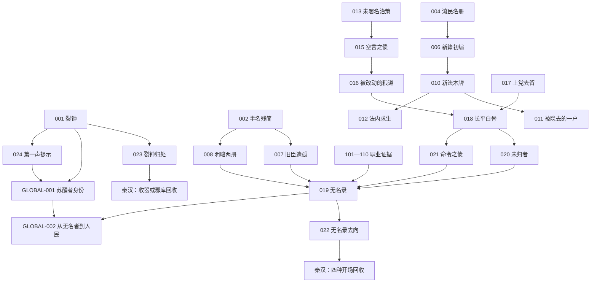

# 第一章《礼崩之世》因果节点表 V0.1

> 目录归属：`docs/chapters/CH01_礼崩之世/`
>
> 文档状态：第一版完整因果设计
>
> 上游文档：`../../01_跨朝代因果总表_V0.1.md`、`01_主线大纲_V0.1.md`、`02_人物关系表_V0.1.md`、`03_职业线嵌入表_V0.1.md`
>
> 用途：登记第一章所有已承诺的坑位，规定种因、即时结果、组合与互斥、跨章载体、回收事件、兜底路径和最终闭环。

## 1. 因果不是奖惩

本项目的因果定义是：

> 选择会进入人物、制度、文字、地点与后世，并继续生长。

因此，因果节点不记录“善恶值”，而记录：

- 玩家做了什么。
- 谁从中受益。
- 谁替这个选择承担代价。
- 当时谁知道真相。
- 哪一种版本被写进官档。
- 哪一种版本在民间流传。
- 哪件物、哪段文字、哪个后人或哪个地点把它带入后世。
- 后世事件怎样让旧选择重新产生现实影响。

善意可能结出苦果，冷酷的制度选择也可能在短期救下更多人。回收事件的任务不是给玩家发奖状，而是让玩家看见选择没有停在当时。

## 2. 节点编号与类型

### 2.1 编号范围

| 范围 | 用途 |
|---|---|
| `SW-CH01-001`—`SW-CH01-025` | 第一章主线、人物、制度与跨章骨架节点 |
| `SW-CH01-101`—`SW-CH01-110` | 十条职业线的独有责任节点 |
| `SW-GLOBAL-001` | 苏醒者身份根节点 |
| `SW-GLOBAL-002` | 从无名者到人民的终极母题根节点 |

物件、文本和地点是节点载体，不另行伪装成因果。它们使用语义标识：

```text
ITEM：裂钟残片、旧印残面、木尺、药箱、种子
TEXT：半名残简、明暗两册、盟书、伤簿、亡国旧曲
LOC：洛水旧渡、旧礼器库、上党、长平、山中墓地
SYSTEM：编户、连坐、军功、徭役、郡县、统一书写
```

### 2.2 节点类型

| 类型 | 说明 | 示例 |
|---|---|---|
| 骨架节点 | 无论路线都必须出现；玩家改变其形态和意义，不能使其从故事中消失 | 裂钟、长平白骨、无名录、第一声提示 |
| 分支节点 | 玩家选择一种处理方式，其余方式互斥 | 明暗两册、隐丁案、无名录去向 |
| 聚合节点 | 汇总多个上游选择，自身不是一次单独选择 | 无名录、未归者、命令之债 |
| 状态节点 | 描述玩家的主要实践倾向，用于后续文本，不直接作为善恶结算 | 法内求生、百家之问、新秩序之门 |
| 职业节点 | 所选路线完整激活；未选路线可由锚点 NPC 低强度种下 | 山中藏名、驳回奏简、伤簿医方等 |
| 路由节点 | 决定下一章从哪一种载体进入，但在完成路由后关闭 | 无名录去向、裂钟归处 |

## 3. 节点生命周期

```text
未出现
→ 已埋下
→ 本章发生结果
→ 已形成载体
→ 跨章首次回收
→ 多章回响或转交新节点
→ 终局闭环
```

### 3.1 状态定义

| 状态 | 判定条件 |
|---|---|
| `UNSEEN` | 玩家、主要人物和叙事都尚未接触。 |
| `PLANTED` | 已出现选择、物件、文字或承诺，未来回收条件已成立。 |
| `LOCAL_RETURNED` | 同一章内已看到一次具体后果。 |
| `CARRIED` | 至少一个可信载体进入下一时段。 |
| `CROSS_RETURNED` | 后世事件已让该节点再次影响现实行动。 |
| `ECHOING` | 节点的原始问题已回答一部分，但其母题转入更大历史问题。 |
| `FINALIZED` | 终局事件完成，不再留下“它究竟指向什么”的核心疑问。 |

### 3.2 什么才算填坑

满足以下三项才算一次有效回收：

1. 玩家能识别它与旧节点有关。
2. 它改变当前章的人物选择、制度处境或事件结果。
3. 回收后节点状态发生变化，而不只是多了一段说明。

以下内容不算填坑：

- 路人提一句“听说古代发生过这件事”。
- 旁白直接解释某物来自前世，但当前人物无需行动。
- 同一物件原样出现，却没有新的处境和代价。
- 为了制造惊喜，否定玩家此前已确认的事实。

## 4. 真相与记载必须分层

同一件事可能有多个版本，但不能把“版本冲突”写成底层事实自相矛盾。

每个重要人物命运与事件至少区分：

```text
truth_state       实际发生了什么
player_knowledge  玩家当前知道多少
official_record   官档如何记载
private_record    私人文字如何记载
oral_version      民间如何传说
public_meaning    当时社会如何解释
```

示例：韩宁在长平失踪。

| 层级 | 可能内容 |
|---|---|
| 实际 | 韩宁受伤后被山民救走，数年后病逝。 |
| 玩家所知 | 最后见她带着残简离开伤营，此后不知所终。 |
| 官档 | 记作“亡”，或根本无名。 |
| 私录 | 《无名录》记“未归”。 |
| 口述 | 有人称她北去，有人称她死于谷中。 |
| 后世回收 | 第二章遇见她保存的残简，但不因此自动得知她完整晚年。 |

后世找到残简，可以填上“她是否把记录送出”的坑；她具体死于何时仍可保持有意义的不确定。填坑不等于把所有历史空白都变成上帝视角答案。

## 5. 因果依赖图



### 5.1 《无名录》的最低成立条件

`SW-CH01-019 无名录` 必须至少拥有：

1. 一种书面或物质底本：
   - `004 第一份流民名册`
   - `008 明暗两册`
   - `109 明暗官册`
2. 一种人的证言：
   - `007 旧臣遗孤`
   - `020 未归者`
   - `104 同伍旧约`
   - `105 病证与役籍`
   - `106 旧曲名段`
   - `110 田亩未归`
3. 一种责任证据：
   - `015 空言之债`
   - `016 被改动的粮道`
   - `021 命令之债`
4. 一个地点或遗物锚点：
   - 裂钟与旧库
   - 洛水旧渡
   - 上党道路
   - 长平与山中墓地

所选职业提供主要证据，未选职业由锚点 NPC 提供一至三种低完整度辅助证据。无论路线如何，《无名录》都能成立，但完整度、可信度、暴露风险和传播方式显著不同。

## 6. 主线节点登记表

| ID | 名称 | 等级 / 类型 | 首次出现 | 玩家种因方式 | 本章即时结果 | 必须回收 / 最终闭环 |
|---|---|---|---|---|---|---|
| SW-CH01-001 | 裂钟 | P0 骨架 | ACT01 | 靠近、保存、借用或拒绝赋予其意义 | 建立记忆入口；物质状态开始变化 | ACT08 决定物质去向；秦汉以礼器事件回收；终章由哀旧之钟转为人民苏醒之声 |
| SW-CH01-002 | 半名残简 | P1 骨架 | ACT01 | 先辨认、先救人、公开互认或隐去身份 | 决定韩宁信任与初始名册完整度 | ACT03 揭示父亲笔迹；ACT07 并入无名录；秦汉以旧简残名回收后关闭独立节点 |
| SW-CH01-003 | 亡国旧曲 | P1 长线 | ACT01 | 保存旋律、追问国名、协助改词或拒绝传唱 | 决定旧曲是悼国、悼人还是权力颂辞 | ACT05、ACT07 本章两次改义；秦汉禁曲；隋唐宫乐、宋元亡国戏、近现代人民歌声；终章完成从悼亡到发声 |
| SW-CH01-004 | 第一份流民名册 | P1 骨架 | ACT01 | 记录姓名、只记特征、隐去逃亡者或交众人互认 | 决定谁有临时身份，谁仍失名 | ACT02 与新籍比对；ACT07 成为无名录早期底本；秦汉重抄时完成首次跨章闭环 |
| SW-CH01-005 | 旧仓之粮 | P3 分支 | ACT02 | 依旧礼请命、接受编户、私下调粮 | 决定聚落生存、债务和役责 | ACT04 隐丁案回收“粮与身份交换”；ACT08 结清本世家庭结果后关闭 |
| SW-CH01-006 | 新籍初编 | P1 制度 | ACT02 | 接受、拖延、修改、另建私录 | 救济名册转为治理名册 | ACT04 新法木牌直接读取；秦汉章开场以编户现实回收，之后转交秦汉户籍节点 |
| SW-CH01-007 | 旧臣遗孤 | P1 人物长线 | ACT03 | 支持保存旧名、保护现身份、利用或交出旧档 | 改变韩宁对父亲与旧国的理解 | ACT07 韩宁以生还、死亡、失踪或双版本进入无名录；秦汉回收后人或残简；近现代以放下旧姓完成家族线闭环 |
| SW-CH01-008 | 明暗两册 | P1 分支 | ACT03 | 保存原籍、改名换籍、制双册、公开毁册 | 决定活人安全与记录真实性 | ACT07 决定无名录底本；秦汉出现一册或矛盾双册；魏晋抄本分裂后关闭本节点并转交无名录长线 |
| SW-CH01-009 | 被重写的姓氏 | P2 人物 | ACT03 | 保留、隐藏、替换或放弃旧姓 | 改变韩宁与流民后人的身份风险 | 秦汉以后通过后人、族谱与旧姓回收；近现代后人主动以人民身份重新开始时闭环 |
| SW-CH01-010 | 新法木牌 | P1 制度长线 | ACT04 | 依法登记、利用规则、修改执行、规避或抗拒 | 新法进入田亩、家庭、军功与连坐 | ACT06 变成征发效率；秦汉以律令日常回收；本节点完成后将母题转交各章制度节点，终章转向人民组织自身 |
| SW-CH01-011 | 被隐去的一户 | P2 人物 / 制度 | ACT04 | 登记、藏匿、替役、病免或赎役 | 一户与同伍的劳力、处罚和信任改变 | ACT06 名字进入或离开征发册；ACT07 决定家人去向；秦汉户籍疑案或后人事件完成闭环 |
| SW-CH01-012 | 法内求生 | P1 状态 | ACT04 | 形成服从、规避、改良、公开反对中的主要实践 | 改变公孙砚、申不疑与官署关系 | ACT08 汇入新秩序之门；秦汉第一次面对律令时回收，不作为独立物件坑 |
| SW-CH01-013 | 未署名治策 | P1 文字 | ACT05 | 提炼推广、保留人名、并列立场、民间传抄 | 决定文本署名、细节和传播对象 | ACT06 被苏离删改使用；秦汉残篇被错署名；魏晋考据出两种版本后闭环 |
| SW-CH01-014 | 百家之问 | P1 状态 | ACT05 | 选择制度、具体人、复杂并置或民间传播的优先次序 | 形成玩家回答时代问题的语言 | 每章以新问题回响，不要求同一答案；终章确认历史主体改变时闭环 |
| SW-CH01-015 | 空言之债 | P1 人物 / 政治 | ACT06 | 如实、隐瞒、夸大、揭露或拒绝盟书 | 承诺与可兑现资源产生差额 | ACT07 由具体缺粮、失援和撤离失败回收；ACT08 苏离等人承担结果；若原稿存续则秦汉再回收一次后关闭 |
| SW-CH01-016 | 被改动的粮道 | P1 事件 | ACT06 | 交付、隐路、改路、延运、公开图册 | 不同聚落、军队和流民承担不同压力 | ACT07 必须明确哪批人因此生还或受损；ACT08 通过债册、遗属或荒地结算，不无限悬置 |
| SW-CH01-017 | 上党去留 | P1 地点 / 人物 | ACT06 | 支持留守、撤离、接受新属、保护百姓自主选择 | 决定当地故人与流民进入长平的方式 | ACT07 以具体家庭命运回收；ACT08 以迁徙、失地或新编户结束本章地方线 |
| SW-CH01-018 | 长平白骨 | P0 骨架 | ACT07 | 救治、埋葬、辨认、执行、拒绝或留下见证 | 形成不可逆损失，汇聚此前制度与战争因果 | 秦汉旧卒 / 旧地回收；后世战场反复追问；终章作为旧时代以人民为柴薪的证据闭环 |
| SW-CH01-019 | 无名录 | P0 聚合 | ACT07 | 汇集官册、私录、口述、遗物、地名和空格 | 生成完整度、暴露度、分布度与争议度不同的记录 | ACT08 决定去向；各章持续增补、误读与重写；终章成为人民自己维护的公共名册 |
| SW-CH01-020 | 未归者 | P1 聚合 | ACT07 | 搜寻、认定死亡、保留未归、隐藏生还或归还遗物 | 每位重要故人获得事实与记载的分层状态 | 至少在秦汉回收一位；其余按后世载体回收；允许事实不明，但必须完成家属与社会如何纪念的叙事闭环 |
| SW-CH01-021 | 命令之债 | P1 聚合 | ACT07 | 执行、拖延、改写、拒绝或记录命令 | 形成责任链与具体受害 / 受益者 | ACT08 生还者面对结果；秦汉制度沿用时再次影响现实；后世战争节点继承问题而非复制同一事件 |
| SW-CH01-022 | 无名录去向 | P1 路由 | ACT08 | 官藏、家属行旅、裂钟旧库、乐人旧曲四选一 | 确定第二章开场载体和记录风险 | 第二章首个事件必须回收并关闭此路由节点；无名录主体继续 |
| SW-CH01-023 | 裂钟归处 | P1 路由 | ACT08 | 官库、旧库、民间、残片或熔铸记录 | 决定第二章能否见实物、残片或仅见器物档案 | 秦汉礼器事件必须回收并关闭位置谜题；裂钟母题继续 |
| SW-CH01-024 | 第一声真正提示 | P0 骨架 / 全局接口 | ACT08 | 无分支，满足结局后必定听清 | 确认“并非第一次”，仍不提供个人前世姓名 | 激活 `SW-GLOBAL-001`；中期排除帝王、神明、单一家族答案；终章揭示共同回声 |
| SW-CH01-025 | 新秩序之门 | P1 状态 / 章节接口 | ACT08 | 形成接受、警惕、参与改良、抵抗中的复杂认识 | 决定第二章初面对统一制度时的情绪与语言 | 第二章第一幕用真实律令处境检验并更新，完成第一章问题到第二章问题的交接 |

## 7. 主线分支节点的互斥与兼容

### 7.1 `SW-CH01-008 明暗两册`

四种主状态互斥，只能有一个：

| 状态 | 活人安全 | 原始记录 | 暴露风险 | 后续载体 |
|---|---:|---:|---:|---|
| `PRESERVE_ORIGINAL` 保存原籍原名 | 低 | 高 | 高 | 原册、韩宁、官档争议 |
| `REWRITE_FOR_LIVING` 改名换籍 | 高 | 低 | 中 | 新籍、口述、后人记忆 |
| `DUAL_LEDGER` 制作明暗两册 | 中至高 | 高 | 最高 | 官册与暗册两个版本 |
| `DESTROY_RECORD` 毁册断追索 | 眼前高 | 极低 | 低至中 | 灰烬、笔迹证言、流民口述 |

`DESTROY_RECORD` 不允许后世突然出现完整原册。可回收的只能是：

- 被提前拆出的单枚残简。
- 目击焚毁者的证言。
- 官署曾经引用过的抄句。
- 因记录消失而发生的身份后果。

### 7.2 `SW-CH01-011 被隐去的一户`

主处理方式互斥：

```text
REGISTERED     如实登记
CONCEALED      隐匿成年劳力
SUBSTITUTED    以赎金、工程、运输或他人替役
EXEMPTED       以真实病伤或正式裁量缓免
```

处理方式与执行结果分开：

```text
处理方式：玩家想怎么做
执行结果：官署是否接受
转嫁结果：缺额最后由谁承担
```

这样可避免“玩家选择病免，所以制度一定认可”的逻辑跳跃。

### 7.3 `SW-CH01-012 法内求生`

记录一个主要倾向和一个次要倾向：

```text
主要：OBEY / EVADE / REFORM / RESIST
次要：允许为空，或记录玩家在极端处境下采用的另一方式
```

它不是人格标签。玩家可以总体尝试改良，却在某次事件中规避法令。

### 7.4 `SW-CH01-022 无名录去向`

主去向四选一：

```text
ARCHIVE       交入官藏
DISTRIBUTED   分给家属与行旅
BELL_CACHE    藏入裂钟或旧库
SONG          托付乐人旧曲
```

可以存在一个低完整度次级痕迹，例如交官藏前有人背下一段曲，但次级痕迹不能等同于第二份完整《无名录》。主选择必须继续影响完整度和风险。

### 7.5 `SW-CH01-023 裂钟归处`

裂钟状态和无名录去向是两个时间维度：

| 字段 | 说明 |
|---|---|
| `act8_bell_state` | ACT08 选择发生时，裂钟在旧库、官库、民间或只剩残片 |
| `between_chapters_transfer` | 第一章死亡后到第二章醒来前，裂钟是否被征收、迁移、熔铸 |
| `ch2_recovery_form` | 第二章见到整钟、残片、拓记、器物清单或只听到相似钟声 |

若裂钟已破坏：

- `BELL_CACHE` 不被粗暴禁用，而改成“藏入裂钟残片所在的器物匣 / 旧库夹壁”。
- 第二章只能找到残片或档案，不能恢复完整钟。
- 物质损失永久保留，记忆母题仍可继续。

## 8. 职业节点登记表

职业节点有三种激活强度：

| 强度 | 条件 | 后续要求 |
|---|---|---|
| `PRIMARY` | 玩家选择该人生线并完成核心选择 | 必须在 ACT07 形成独有证据，并在第二章出现明确回收 |
| `NPC_SEEDED` | 玩家未选该线，但锚点人物参与共享事件 | 可成为无名录辅助材料；后世只在相关人物关系足够时单独回收 |
| `LOST` | 锚点死亡、决裂或材料毁失，且没有替代见证 | 不再承诺完整材料，只保留由缺失本身造成的后果 |

| ID | 职业 | 节点名称 | 首次出现 | 玩家种因 | ACT07 证据 | 第二章必填坑事件 |
|---|---|---|---|---|---|---|
| SW-CH01-101 | 隐士 | 山中藏名 | ACT04 | 藏匿、劝降、转移或交涉 | 山路、假名、生还者、山中墓地 | 清查逃籍者时发现旧藏名册；确认一位“官册已亡”者的真实后果 |
| SW-CH01-102 | 仕官 | 驳回奏简 | ACT04 | 请求缓征、改役、赦免或执行 | 命令、驳回、放粮与撤离申请 | 秦汉官档中旧奏简影响一户现实处置，不能只作为收藏品 |
| SW-CH01-103 | 谋士 | 被删改的治策 | ACT05 | 删名、保名、改数、民间传抄 | 原稿、盟书与删改链 | 统一档案将无名原稿错署名；玩家通过事件发现署名与责任不一致 |
| SW-CH01-104 | 武将 | 同伍旧约 | ACT05 | 立约、保名、服从、拒命或托付 | 卒伍名记、投降见证、家书 | 戍卒或家属收到旧同伍名记，改变当前章一次服役 / 认领选择 |
| SW-CH01-105 | 医者 | 病证与役籍 | ACT04 | 开病证、拒证、真实缓役或医役替代 | 伤簿、体貌、死亡时间、医方 | 戍边疫病中旧医方救人，同时暴露旧病证曾转嫁役责的代价 |
| SW-CH01-106 | 戏子 | 旧曲名段 | ACT05 | 保留原词、改词示警、献艺或禁唱 | 曲调名序、绰号、最后言语 | 禁曲事件中必须选择删名保曲或冒险唱全，旧选择改变可用歌词 |
| SW-CH01-107 | 商贾 | 无法结清的粮债 | ACT05 | 高价维持、低价救人、私运、改道 | 粮册、车号、关卡戳记、遗属债 | 统一度量时发现旧债无法换算；必须决定按官价结清还是承认人命不可折算 |
| SW-CH01-108 | 工匠 | 木尺两用 | ACT05 | 造农具、军械、改车、拆桥或留工记 | 工坊记号、墓标、木尺、工图 | 秦汉官营工程重用旧图；救民与征发两种用途同时回响 |
| SW-CH01-109 | 吏官 | 明暗官册 | ACT04 | 如实、留白、双册、拖延或销毁副本 | 官册底本、删改痕迹、时间链 | 小吏重抄旧简时发现被划名字；当前章必须决定再抄、保留空格或揭露 |
| SW-CH01-110 | 农人 | 田亩未归 | ACT04 | 藏人、替役、供粮、藏粮、逃亡或守田 | 小地名、亲属称呼、种子、未归口述 | 新编户籍与旧田界冲突，后人以故地木片或种子提出认领 |

### 8.1 职业节点不允许的组合错误

- 玩家不是医者时，可以获得小蓟的伤簿，但不能拥有医者线完整诊断权限。
- 玩家不是吏官时，可以得到孟简交出的副本，但不能声称自己亲手修改全部官册。
- 玩家不是谋士时，可以看见盟书结果，不能无条件知道全部删改过程。
- 玩家不是武将时，可以听见降卒证言，不能拥有完整军令视角。
- `NPC_SEEDED` 材料完整度必须低于玩家主路线的 `PRIMARY` 材料。
- 一条材料标记为 `LOST` 后，只能通过残片、旁证或缺失后果回收，不能原样出现。

## 9. 《无名录》聚合逻辑

### 9.1 四个质量维度

| 维度 | 低状态 | 高状态 | 高并不总是更好 |
|---|---|---|---|
| `record_integrity` 完整度 | 名字少、空格多、时间断裂 | 多种材料互证 | 越完整越可能暴露逃亡者与家属 |
| `record_exposure` 暴露度 | 隐蔽、难以查找 | 官署与公众可见 | 越可见越容易被删改、追责或利用 |
| `record_distribution` 分布度 | 单本集中 | 多份分散 | 越分散越难一次毁尽，也越容易版本分裂 |
| `record_contestation` 争议度 | 只有一种版本 | 官档、私录、口述互相冲突 | 高争议不等于错误，它可能更接近复杂真相 |

### 9.2 聚合结果

| 主要形态 | 形成条件 | 优势 | 缺陷 |
|---|---|---|---|
| 官档型 | 吏官 / 仕官证据强，官藏去向 | 时间、姓名和责任链较完整 | 易删去无法核验者与不利命令 |
| 私录型 | 韩宁、隐士、农人材料强，家属分发 | 贴近个人与乡里 | 零散、偏向熟人、难以汇总 |
| 口述型 | 戏子、农人、未归者证言强，旧曲去向 | 跨越识字限制，传播广 | 姓名、次序和因果易变形 |
| 物证型 | 工匠、医者、武将、商贾材料强，裂钟藏匿 | 器物、伤痕、车号和地点击穿官面叙述 | 需要后人重新解释，容易只剩“古物” |
| 矛盾双本型 | `DUAL_LEDGER` 且至少两类证据存续 | 能看见谁改了什么 | 暴露风险高，后世可能争真伪而忘记人 |

不设置“完美无名录”。最高完整度必须伴随更高暴露风险或更强版本争议。

### 9.3 最低兜底不等于选择无效

如果玩家拒绝记录、毁掉册籍或与韩宁决裂：

- 季伯残简、孟简官册、柳娘曲调或禾安口述中至少保留一种低完整度证据。
- 《无名录》仍会形成，但玩家失去对内容、署名和去向的主导。
- 后世回收时会明显表现为空格更多、误认更多或由他人解释。

骨架不断裂，但选择决定记录究竟是什么。这比“玩家一烧，主线物件又神奇复原”更诚实。

## 10. 未归者与人物命运闭环

每位 A、B 级人物在 ACT08 结束时必须有一条命运记录：

| 字段 | 允许值 |
|---|---|
| `truth_state` | 生还、死亡、失踪后生还、失踪后死亡、未知 |
| `official_record` | 在、亡、逃、降、无名、无记录 |
| `player_knowledge` | 亲见、可信转述、矛盾证言、不知 |
| `family_outcome` | 得到确认、继续等待、收到遗物、改名迁徙、无人可通知 |
| `future_carrier` | 后人、简、曲、器物、地点、制度记录、无 |
| `scheduled_return` | ACT08、CH02、CH03—CH06、近现代、终章 |

### 10.1 三种合法填坑方式

1. **事实确认**
   - 找到可信遗物、尸骨、亲见者或后人，确认生死。
2. **后果确认**
   - 无法确认生死，但明确家属、田地、债务和记忆如何继续。
3. **公共纪念**
   - 真相永久不可知，但“未归”被正式保留，不再强行写成一个虚假确定答案。

第三种不是偷懒。历史中确有无法恢复的姓名与命运；叙事闭环可以是社会终于承认“不知道”，而不是编造确定性。

### 10.2 不允许的处理

- 失踪人物在数章后无解释地重新出现。
- 为反转而推翻玩家亲眼确认的死亡。
- 角色死亡只为刺激苏醒者，后世不再影响任何人。
- 所有亲密人物都靠高好感度幸存。
- 只写“某人后代出现”，却不说明中间载体如何跨过年代。

## 11. 核心母题的跨章填坑计划

### 11.1 裂钟

| 阶段 | 必须发生的事件 | 填哪一层坑 |
|---|---|---|
| 第一章 | 现实裂钟与梦中钟声重合；ACT08 决定物质去向 | 它不是纯梦境，且与旧秩序崩坏有关 |
| 秦汉 | 收天下礼器、郡库清点或残片重铸；玩家因裂纹产生记忆反应 | 填“钟去了哪里”，不填“苏醒者是谁” |
| 魏晋 | 礼制崩裂时，古钟铭文或旧库记录被重新解释 | 钟不是某一王朝专属 |
| 隋唐 | 古钟或拓记进入长安旧库，盛世中仍带裂纹 | 盛世没有抹平旧代价 |
| 宋元 | 金石研究者考证钟铭，发现无名修补痕迹 | 把关注从王名转向造钟、修钟者 |
| 明清 | 城门炮声与裂钟声叠合，旧制度面对新世界 | 钟从礼崩象征转向旧时代整体裂缝 |
| 近现代 / 终章 | 钟声与人潮、劳动和共同发声重叠 | 最终确认它不是召回帝王，而是无名者共同苏醒的声音 |

### 11.2 无名录

| 阶段 | 必须发生的事件 | 节点变化 |
|---|---|---|
| 第一章 | 从流民册、旧籍、长平证据汇成，决定去向 | `PLANTED → CARRIED` |
| 秦汉 | 按四种去向之一触发开场；统一书写仍留下残名与空格 | `CROSS_RETURNED` |
| 魏晋 | 流亡者抄录残页，不同版本随南渡分散 | 分布度上升、完整度下降 |
| 隋唐 | 边塞或官库文本引用其中一名无名卒 | 从私人文本进入盛世叙事的缝隙 |
| 宋元 | 史官、杂剧或金石家争论真伪；旧曲与名录交叉 | 争议度上升，普通人开始主动讲述 |
| 明清 | 地方志、族谱和旧戏重新拼接，但仍受旧秩序分类 | 名录扩大，仍由他者命名 |
| 近现代 | 工人名册、农会名册、烈士碑与旧残卷并置 | 无名者从被记录对象转向记录自己 |
| 终章 | 由人民公开增补、维护并继续书写，不再追求一本神圣原本 | `FINALIZED`：无名录成为人民自己的历史实践 |

### 11.3 亡国旧曲

| 阶段 | 回收事件 | 意义 |
|---|---|---|
| 第一章 | 从悼一国改成悼亡者与未归者 | 超越旧国忠义 |
| 秦汉 | 禁曲或改词；玩家选择保曲删名、保名冒险或另造暗语 | 文化记忆与制度管控冲突 |
| 魏晋 | 流亡者私唱，不同故国都称它是“自己的曲” | 曲子不再属于单一国 |
| 隋唐 | 入宫为旧乐，原意被繁华遮蔽 | 被收编仍保留裂缝 |
| 宋元 | 民间杂剧与亡国词重新赋义 | 普通表演者重新夺回解释 |
| 明清 | 旧乐棚、戏台与海潮炮声并置 | 从悼王朝转向问旧制度 |
| 近现代 / 终章 | 改为群众共同歌声，不再由乐人替所有人发言 | 从“唱给人民听”变成“人民自己唱” |

### 11.4 新法木牌

| 阶段 | 回收事件 | 意义 |
|---|---|---|
| 第一章 | 授田、编户、连坐、军功同时进入家庭 | 法的双面性成立 |
| 秦汉 | 上一章木牌上的规则成为天下日常 | 填“新法后来怎样”，转交秦汉制度节点 |
| 魏晋至明清 | 门阀、律令、科举、赋役、里甲等新节点分别承接 | 不把所有制度都粗暴说成同一秦法 |
| 近现代 | 旧制度失去组织新社会的能力 | 制度母题从“谁管理人民”转向“人民如何组织自己” |
| 终章 | 制度成为人民共同创造未来的工具，而非外在木牌 | 完成方向反转 |

### 11.5 长平白骨

| 阶段 | 回收事件 | 意义 |
|---|---|---|
| 第一章 | 不可逆死亡、埋葬与无名录形成 | 战争因果不随胜负结束 |
| 秦汉 | 旧卒、史官或戍卒家庭面对长平旧债 | 统一道路与战争代价相连 |
| 魏晋 / 隋唐 | 新乱葬岗、边塞战场与长平记忆重叠 | 不把白骨只归咎一人一战 |
| 宋元 / 明清 | 亡国战场、地方志和出土遗骨再次提出认领问题 | 史书数字与具体身体冲突 |
| 近现代 | 旧式争霸战争与人民为自身解放而战形成区别 | 战争性质成为新问题 |
| 终章 | 白骨被作为旧时代让人民承担争霸代价的证据公开纪念 | 死者不再只是王朝功业的背景 |

### 11.6 旧臣遗孤与被重写姓氏

| 阶段 | 回收事件 | 意义 |
|---|---|---|
| 第一章 | 韩宁父亲真相、双册和韩宁命运 | 忠于百姓不等于忠于旧主 |
| 秦汉 | 后人成为秦吏、儒生、叛者、史官或普通编户之一 | 后人不被祖先立场锁死 |
| 魏晋至明清 | 族谱、门第、旧姓与乡约不断重新解释 | 姓名既保存记忆也制造等级 |
| 近现代 | 后人主动放下旧姓带来的特权或仇债 | 私人家族因果让位于更大共同身份 |
| 终章 | 韩宁父女作为普通记录者被重新看见，而非恢复贵族荣名 | 完成从家名到人民之名 |

### 11.7 苏醒者身份与第一声提示

| 阶段 | 必须排除 / 确认 | 不允许的误导 |
|---|---|---|
| 第一章 | 只确认不是第一次看见山河改色 | 不暗示他是某位帝王转世 |
| 秦汉 | 记忆与个人血缘、遗物所有权对不上 | 不用神秘组织直接解释轮回 |
| 魏晋 | 不同家族都能提出“你是我祖先”的假证据 | 不让任一族谱成为正确答案 |
| 隋唐 / 宋元 | 苏醒者记得互相冲突的职业与社会位置 | 明确不是一条单人灵魂履历 |
| 明清 | 多个无名者经验同时涌现，个人身份解释开始崩解 | 不提前直接说出“人民”作为答案 |
| 近现代 | 苏醒者第一次在同时代共同运动中感到记忆不是孤立的 | 从共同实践而非旁白接近答案 |
| 终章 | 确认苏醒者是千千万万无名者共同的历史回声 | 不是神、救世主、帝王或单一家族祖先 |

## 12. 第一章到第二章的强制回收清单

第二章至少必须在主线中完成下列事件，不能全部放进可错过支线：

| 回收事件 | 必须读取的第一章节点 | 当前章现实作用 | 完成后关闭 / 转交 |
|---|---|---|---|
| CH02-CB-01 开场载体 | 019、022，加所选职业节点 | 决定新一世首先接触的旧因果 | 关闭 022，019 继续 |
| CH02-CB-02 裂钟入库 | 001、023 | 触发记忆并决定旧简或器物是否被发现 | 关闭 023，001 继续 |
| CH02-CB-03 旧户疑案 | 006、010、011、012 | 当前家庭面临户籍、徭役或戍边选择 | 关闭 006、011；010 转交秦汉制度节点 |
| CH02-CB-04 禁曲或改词 | 003、106（若激活） | 乐人是否保留姓名影响现实人物安全 | 003 继续长线 |
| CH02-CB-05 长平旧卒 | 018、020、021、104（若激活） | 认领、服役或史官记载发生改变 | 至少关闭一名未归者子节点 |
| CH02-CB-06 旧简署名 | 002、008、013、103 / 109（按激活） | 决定旧记录被谁拥有、如何重抄 | 关闭 002；008 / 013 转入版本争议 |

### 12.1 第二章开场路由

| `SW-CH01-022` | 第二章开场 | 必须出现的缺陷 |
|---|---|---|
| ARCHIVE | 小吏重抄统一文字之前的旧简 | 无法核验的名字被要求删除 |
| DISTRIBUTED | 戍卒或家属收到残缺家书 / 私录 | 多份版本互相矛盾，无法拼成完整册 |
| BELL_CACHE | 收取礼器或清点郡库时发现夹藏物 | 记录保存较真，但长期无人知晓，且可能只剩残片 |
| SONG | 市井或宫廷乐人接触禁曲 | 传播最广，姓名和原意变形最严重 |

无论开场选哪一条，其余三种载体可在第二章作为支线或旁证出现，但不得同时都拥有完整原本。

## 13. 载体登记与损毁兜底

| 母题 / 总表承诺 | 第一章载体 | 绑定节点 | 若载体损毁 | 合法后世回收 |
|---|---|---|---|---|
| 裂钟 | 整钟、残片、铭文拓记、器物清单 | 001、023 | 永久失去完整实物 | 残片、熔铸记录、修补痕迹、相似钟声 |
| 无名录 | 官册、私录、曲调、物证、空格记号 | 019、022 | 完整度下降，不生成神奇备份 | 单枚残简、家属抄本、口述、缺失本身 |
| 亡国旧曲 / 旧戏台 | 柳娘与阿檀、曲调、歌词、社场记忆 | 003、106 | 原词失传 | 变调、禁令、他人误唱、改词痕迹 |
| 旧臣遗孤 / 后人 | 韩宁、父亲笔迹、隐藏本姓 | 002、007、009 | 韩宁无后或记录断裂 | 同行证言、双册另一端、后人之外的公共记录 |
| 新法木牌 | 木牌、户籍、军功与执行后果 | 006、010、011 | 木牌实物腐朽 | 制度已进入生活，靠案卷与后果回收 |
| 长平白骨 | 遗骨、墓地、伤簿、同伍名记 | 018、020、021 | 墓地失落或被扰动 | 地方记忆、出土遗物、家书、身体证据 |
| 旧印 / 玉佩 | ACT03 可选旧印残面或身份物 | 008、009 | 若未种下，后世不得凭空出现 | 若种下则统一文字重刻、收藏或博物馆回收 |
| 药箱 / 医方 | 小蓟伤簿、药箱、医方 | 105 | 药箱损毁 | 医方抄本、被救者后人、错误抄方造成的新因果 |
| 木尺 / 工图 | 鲁砚木尺、两用工图、工坊记号 | 108 | 原图损毁 | 器物成品、工记、后人复原但出现误差 |
| 旧河 / 渡口 | 洛水旧渡、上党道路、粮道 | 004、016、017 | 地貌或名称改变 | 新道路、漕运、南渡、码头与铁路在同地回响 |
| 田亩 / 种子 | 禾安种子、田界木片、小地名 | 110 | 失地或种子断代 | 后人认领、地名口述、旧田界与新户籍冲突 |

### 13.1 可选载体承诺规则

旧印、玉佩等未被主线强制种下的物件，只有在第一章实际出现并登记后才能进入后世。跨朝代总表中的“例子”不是无条件承诺。

这条规则用于防止：

- 为了回收而在后世凭空创造玩家从未见过的遗物。
- 同一功能堆叠过多玉佩、古印、残剑，削弱核心母题。
- 物件比人物与制度更重要。

## 14. 因果组合与不可能状态

### 14.1 必须成立的约束

1. `019 无名录` 出现前，至少满足第 5.1 节四类证据。
2. `022 无名录去向` 只能在 `019` 已形成后选择。
3. `024 第一声提示` 必须在 ACT08，无任何路线可提前完整听清。
4. `023 裂钟归处` 必须保留物质连续性；整钟毁失后不能再以整钟出现。
5. `020 未归者` 中至少一位长期故人永久死亡或失踪。
6. `008 DESTROY_RECORD` 与“后世找到完整原册”互斥。
7. `011 CONCEALED` 不等于官署相信此人不存在，必须另记清查结果。
8. `016 被改动的粮道` 必须在 ACT07 指向具体受益者与代价承担者。
9. 玩家主职业节点为 `PRIMARY` 时，第二章必须安排对应回收事件。
10. 未种下的可选载体不得在后世作为关键证据出现。

### 14.2 允许并鼓励的矛盾

- 官档记亡，山中口述称生还。
- 盟书称粮足，商账显示无法兑现。
- 医者记录伤后死亡，军册记作战死。
- 戏曲记住绰号，官册只剩陌生本名。
- 后人相信祖先是忠臣，旧简显示其真正保护的是逃亡百姓。

这些是“记载之间的矛盾”，不是底层状态错误。玩家需要通过事件判断相信什么、公开什么、保护谁。

### 14.3 不允许的伪复杂

- 每个版本都说一半真话，最后却没有任何可行动的差异。
- 故意隐藏系统已知事实，只为制造反转。
- 所有选择都导向相同文本，只更换一句评价。
- 用“历史很复杂”回避说明谁承担了代价。
- 让后世人物只负责解说前章，而没有自己的现实困境。

## 15. 填坑审计表

| 坑位 | 是否必埋 | 第一章内回收 | 跨章首次回收 | 终局 / 关闭点 | 断链兜底 |
|---|---|---|---|---|---|
| 裂钟 | 是 | ACT04、ACT06、ACT08 | 秦汉礼器事件 | 终章人民苏醒之声 | 残片 / 器物记录 / 修补痕迹 |
| 半名残简 | 是 | ACT03、ACT07 | 秦汉旧简重抄 | CH02—CH03 并入无名录后关闭 | 单枚残简或父亲笔迹证言 |
| 亡国旧曲 | 是 | ACT05、ACT07、ACT08 | 秦汉禁曲 | 终章人民共同发声 | 变调、禁令、误唱痕迹 |
| 第一份流民名册 | 是 | ACT02、ACT07 | 秦汉重抄 | CH02 完成独立闭环 | 私录 / 互认证言 |
| 旧仓之粮 | 是 | ACT04 | 非必需 | ACT08 家庭结果 | 债契 / 役责后果 |
| 新籍初编 | 是 | ACT04、ACT06 | 秦汉编户现实 | CH02 转交制度节点 | 一户与同伍后果 |
| 旧臣遗孤 | 是 | ACT03、ACT07、ACT08 | 秦汉后人 / 残简 | 近现代家名转向共同身份 | 同行证言，不强制有后人 |
| 明暗两册 | 是 | ACT07 | 秦汉矛盾旧简 | 魏晋版本分裂后并入无名录 | 灰烬、抄句、口述 |
| 被重写姓氏 | 条件必埋 | ACT08 | 秦汉后人身份 | 近现代放下旧姓特权与仇债 | 无后人时由公共记录回收 |
| 新法木牌 | 是 | ACT06、ACT08 | 秦汉律令日常 | 终章制度方向反转 | 木牌毁失但制度后果仍在 |
| 被隐去的一户 | 是 | ACT06、ACT07 | 秦汉户籍疑案 | CH02 关闭 | 后人 / 邻户 / 役册 |
| 法内求生 | 是 | ACT08 | 秦汉首次律令选择 | CH02 更新后关闭 CH01 状态 | 人物评价和选择文本 |
| 未署名治策 | 是 | ACT06 | 秦汉错署名残篇 | 魏晋考据两版本 | 引文、批注、口述来源 |
| 百家之问 | 是 | ACT06、ACT08 | 每章新命题 | 终章历史主体改变 | 作为状态，不依赖物件 |
| 空言之债 | 是 | ACT07、ACT08 | 条件性秦汉原稿 | ACT08 或 CH02 关闭 | 失援、缺粮的具体后果 |
| 被改动粮道 | 是 | ACT07 | 条件性商账 / 道路 | ACT08 关闭本次事件 | 荒地、遗属、关卡记录 |
| 上党去留 | 是 | ACT07 | 非必需 | ACT08 地方家庭结局 | 迁徙与失田后果 |
| 长平白骨 | 是 | ACT08 初次余波 | 秦汉旧卒 / 旧地 | 终章公共纪念 | 地点、伤簿、家书 |
| 无名录 | 是 | ACT08 决定去向 | 秦汉开场 | 终章人民公共名册 | 低完整度多载体 |
| 未归者 | 是 | 部分在 ACT08 | 秦汉至少一人 | 各人物预定章节或公共纪念 | 保留“未知”但完成社会后果 |
| 命令之债 | 是 | ACT08 | 秦汉制度沿用 | 后世战争问题转交 | 命令副本、执行者证言 |
| 无名录去向 | 是 | ACT08 选择 | 秦汉开场 | CH02 首事件关闭 | 四路之一必须成立 |
| 裂钟归处 | 是 | ACT08 选择 | 秦汉礼器事件 | CH02 关闭位置谜题 | 残片或器物记录 |
| 第一声提示 | 是 | ACT08 只揭一层 | 秦汉继续排错 | 终章苏醒者身份 | 梦境与重复经验 |
| 新秩序之门 | 是 | ACT08 | 秦汉第一幕 | CH02 更新后完成交接 | 状态节点不依赖载体 |
| 十职业责任节点 | 所选路线必埋 | ACT07 汇流 | 秦汉对应入口 | CH02 或各自母题后续 | NPC 低强度材料，禁止完整替代 |

## 16. 验收清单

- [x] 主线 `001—025` 全部登记，无空号、无重复含义。
- [x] 职业 `101—110` 全部登记，并规定主路线、NPC 种因与材料丢失三种强度。
- [x] 裂钟、无名录、旧臣遗孤、亡国旧曲、新法木牌、长平白骨和第一声提示均有本章回收、跨章事件与最终闭环。
- [x] 第一章至第二章设有六个强制回收事件，不依赖全部可错过支线。
- [x] 真实发生、玩家所知、官档、私录和口述分层，允许版本冲突但避免底层矛盾。
- [x] 明暗两册、隐丁案、无名录去向和裂钟归处写清互斥与兼容。
- [x] 所有核心物件损毁后只允许降级载体，不允许完整复活。
- [x] 未归者允许保留历史不确定，但必须完成事实、后果或公共纪念中的一种闭环。
- [x] 每个职业节点都有第二章现实事件，而不是一句彩蛋。
- [x] 可选遗物只有实际种下后才能在后世出现。
- [x] 因果不使用善恶值，始终追踪受益者、代价承担者和责任链。
- [x] 终章不是解释全部谜底，而是让所有无名者经验汇入人民自己书写历史的实践。
