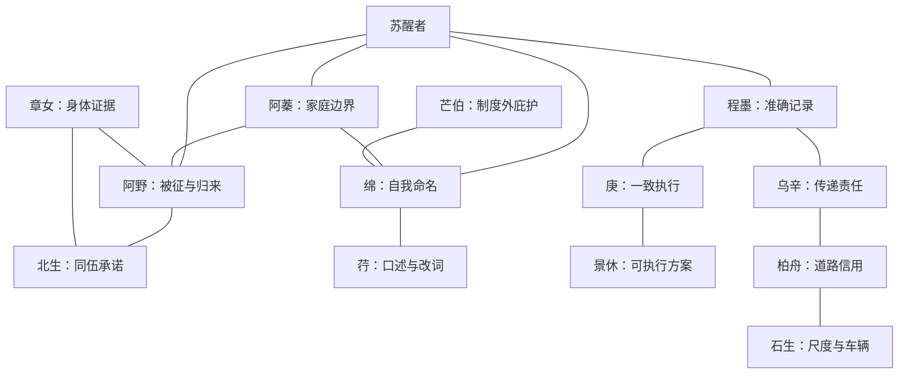

# 第二章《大一统之梦》人物关系表 V0.1

> 上游文档：`00_章节定位与史实边界_V0.1.md`、`01_主线大纲_V0.1.md`
>
> 人物原则：每个人都在统一、崩裂和重建中追求具体生活；没有人只负责代表“秦”“反秦”或“汉”。

## 1. 人物层级

| 层级 | 人物 | 功能 |
|---|---|---|
| 本世家庭 | 阿蓁、阿野 | 让所有制度变化回到一户人的粮、役、田和关系 |
| 核心故人 | 绵、程墨、庚、乌辛 | 推动户籍、道路、县廷和两朝记录主线 |
| 职业锚点 | 芒伯、景休、北生、章女、荇、柏舟、石生 | 使十职业拥有独立关系核心 |
| 历史压力角色 | 军吏、县廷属吏、役夫首领、不同旗号的地方主事者 | 表现结构，不取代真实历史人物 |

## 2. 核心人物

## CH02-CHAR-001 阿蓁

| 字段 | 内容 |
|---|---|
| 公开身份 | 宁里农户与陶器副业经营者；苏醒者本世母亲 |
| 私人欲望 | 让家中至少有一名孩子不被役、战和债带走 |
| 公开原则 | “先保住这一户，才有余力管别人。” |
| 最深恐惧 | 自己的善意最终由孩子替她偿还 |
| 认识盲点 | 把家庭边界看得太紧，可能排斥新流民 |
| 柔软处 | 每次做陶都会在底部刻家中实际吃饭人数，不管官册怎样写 |
| 现实利益 | 田地、种粮、劳力和陶器交换路线 |
| 自认底线 | 不用别人家的孩子替自己的孩子服役 |
| 可能跨线 | 为保苏醒者而默许绵家补缺 |

固定行动：

- ACT01 同意暂时收留绵母，但要求共同承担生活。
- ACT03 在“一户两役”时隐藏一份征发通知。
- ACT05 县廷夜火后优先抢救田册残片。
- ACT07 再次面对失籍者时，根据玩家过去选择决定是否开放本户。

可变命运：

| 状态 | 结果 |
|---|---|
| `HOUSEHOLD_OPEN` | 本户成为战后接纳与共同核验核心 |
| `HOUSEHOLD_CLOSED` | 家庭保存较完整，但与绵和新流民决裂 |
| `DISPLACED` | 失田后经营陶器与交换，家户身份变弱 |
| `DECEASED_WARTIME` | 陶底人数刻记成为家户私录 |

语言特征：用“锅里有几碗”“明年谁下田”衡量主张；很少说“天下”。

## CH02-CHAR-002 阿野

| 字段 | 内容 |
|---|---|
| 公开身份 | 苏醒者异母兄，宁里成年劳力，后可能从役、从军或逃归 |
| 私人欲望 | 不再被所有人只看作家中“该被征走的那一个” |
| 公开原则 | “自己的役，自己去。” |
| 最深恐惧 | 回来时家中已经把他写成亡者并分掉位置 |
| 认识盲点 | 把独自承担当成尊严，拒绝别人共同分担 |
| 柔软处 | 离家前偷偷修好苏醒者小时候用过的木铲 |
| 现实利益 | 军功、归役证明、家庭田份 |
| 自认底线 | 不让绵家代自己补役 |
| 可能跨线 | 为回家接受另一旗号并隐瞒同伍下落 |

固定行动：

- 主动带走自己的役简。
- 无论旗号如何变化，都尝试寄回一次家书。
- ACT07 要求自己的状态由家人而非军功簿单独决定。

命运组合：

```text
RETURNED_WITH_PROOF
RETURNED_WITHOUT_PROOF
RETURNED_UNDER_NEW_BANNER
MISSING_WITH_LETTER
RECORDED_DEAD_BUT_ALIVE
DEAD_WITH_CONFLICTING_TESTIMONY
```

阿野不是玩家的被救对象。他可能拒绝逃走、拒绝军功、也可能为了同伍拒绝回家。

## CH02-CHAR-003 绵

| 字段 | 内容 |
|---|---|
| 公开身份 | 宁里织作与农务少女；母亲来自旧六国流民 |
| 私人欲望 | 自己决定使用哪个名字，而不是被任何家庭“收进去” |
| 公开原则 | “谁写我，先问我。” |
| 最深恐惧 | 母亲死后再无人能证明她原来的名字 |
| 认识盲点 | 把接受帮助视作失去自主，容易拒绝可靠关系 |
| 柔软处 | 给每名离乡者织一小段不同纹样，用于回乡辨认 |
| 现实利益 | 合法居住、粮种、婚姻与劳动关系不被官册替她决定 |
| 自认底线 | 不以揭发另一名失籍者换取自己入籍 |
| 可能跨线 | 为救母亲使用一份她知道并不完全真实的旧简 |

固定行动：

- ACT01 当众拒绝“附入阿蓁户下就算了”的说法。
- ACT04 折印之夜抢出一份失籍妇女名单。
- ACT07 亲自决定旧名、新名、并列名或不公开。

关系方向：

- 与苏醒者可以是亲密故人、共同记录者、长期决裂者或未说出口的爱情，但不强制恋爱。
- 与阿蓁既有收留恩义，也有被替她决定身份的裂痕。
- 与程墨互相需要：她需要文书能力，他需要她指出官册没有什么。

## CH02-CHAR-004 程墨

| 字段 | 内容 |
|---|---|
| 公开身份 | 年长县廷书吏，负责核验、重抄与旧档 |
| 私人欲望 | 证明准确文书可以保护人，而非只替权力追索 |
| 公开原则 | “错一字，便要有人多服一日。” |
| 最深恐惧 | 一生维持的秩序在自己眼前证明不值得维护 |
| 认识盲点 | 相信只要记录足够准确，制度目标本身便可暂时不问 |
| 柔软处 | 收集写坏的木牍，刮净后教孩子识字 |
| 现实利益 | 职位、家口免受牵连、同僚安全 |
| 自认底线 | 不伪造已经发生的事实 |
| 可能跨线 | 在县廷夜火前主动改册保护同僚和家户 |

人物弧线：

```text
相信准确即可
→ 归役简证明准确会被传递链破坏
→ 秦末发现档案既是凭据也是追索工具
→ 汉初承认记录必须允许异议与纠错
```

固定行动：保留迟到归役简原件或可辨认抄件。

## CH02-CHAR-005 庚

| 字段 | 内容 |
|---|---|
| 公开身份 | 年轻书吏，后成为县廷执行骨干或不同政权争取的地方能吏 |
| 私人欲望 | 让任何一套秩序都不能因人情随意失效 |
| 公开原则 | “例外若无边，守约的人就是最先受罚的人。” |
| 最深恐惧 | 再次经历幼年时粮仓被有势者先分走 |
| 认识盲点 | 把一致执行等同公平，低估起点差异 |
| 柔软处 | 会记得每个役夫领取鞋袜的尺寸 |
| 现实利益 | 官署生存、职责清白、地方不陷入无序 |
| 自认底线 | 不销毁公共档案 |
| 可能跨线 | 为避免档案落入军队而下令焚毁 |

庚是本章主要对手之一，但不是反派。

他会：

- 拒绝无凭据补录。
- 主动追查侵吞粮役的上级。
- 在县廷夜火中选择档案而非自己的财物。
- 秦亡后继续替新主事者工作，因为他认为地方仍需有人算粮和户。

玩家可以让他成为制度共同改良者、严格对手、被火吞没的守档者或汉初两籍的主要编者。

## CH02-CHAR-006 乌辛

| 字段 | 内容 |
|---|---|
| 公开身份 | 邮人、道路传递者 |
| 私人欲望 | 完成每一次传递，不再替上级迟误背罪 |
| 公开原则 | “我只保证送到，不保证他们照做。” |
| 最深恐惧 | 途中死去后被写成携文逃亡 |
| 认识盲点 | 用职责边界回避自己对文书内容的责任 |
| 柔软处 | 熟记沿路可饮水的井，并给后来邮人留小石堆 |
| 现实利益 | 役期、口粮、鞋、道路安全 |
| 自认底线 | 不私拆封检 |
| 可能跨线 | 为救一户延迟或替换公文 |

固定行动：在秦末道路断裂后仍送出一封私人家书。

载体：邮程记、封检残片、道路井名。

## CH02-CHAR-007 章女

| 字段 | 内容 |
|---|---|
| 公开身份 | 民间医者与接生者，后可能被征入军民伤营 |
| 私人欲望 | 让出生和死亡都不因贫富、旗号而失去见证 |
| 公开原则 | “病先看身，不先看籍。” |
| 最深恐惧 | 为保护病者隐瞒身份，反而让家属永远找不到 |
| 认识盲点 | 认为隐私天然高于公共核验 |
| 柔软处 | 把每个夭折孩子的生日记在药袋结法中 |
| 现实利益 | 药材、通行、病者信任 |
| 自认底线 | 不开自己明知虚假的死证 |
| 可能跨线 | 战时为保护活人把生者写入亡簿 |

固定行动：无论玩家是否走医者线，她都会在 ACT06 建立一份军民混合伤簿。

## CH02-CHAR-008 石生

| 字段 | 内容 |
|---|---|
| 公开身份 | 量器、车具与道路工程匠人 |
| 私人欲望 | 做出走到哪里都不会骗人、也不会被权势改刻的尺度 |
| 公开原则 | “尺若不一，吃亏的是手里没有另一把尺的人。” |
| 最深恐惧 | 自己改进的器具让征收和战争更高效 |
| 认识盲点 | 把技术中立当成免除责任 |
| 柔软处 | 给孩子做不标刻度的小木鸟 |
| 现实利益 | 官营材料、同坊安全、技艺传承 |
| 自认底线 | 不故意做会害使用者的器物 |
| 可能跨线 | 为拖慢军运暗改车轴与桥梁承重 |

固定行动：保存一把经过秦、战乱和汉初三次重刻的木尺。

## CH02-CHAR-009 柏舟

| 字段 | 内容 |
|---|---|
| 公开身份 | 跨郡行商与粮运组织者 |
| 私人欲望 | 建立一条无论旗号如何变化都能履约的道路信用 |
| 公开原则 | “路断一次，下一回肯运粮的人就少一个。” |
| 最深恐惧 | 自己变成只在灾乱中获利的人 |
| 认识盲点 | 把没有支付能力的人排除在账外 |
| 柔软处 | 为死去车夫继续给家中送一季粮，却不告诉同行 |
| 现实利益 | 车队、债契、关卡关系和粮价 |
| 自认底线 | 不卖同一批粮给交战双方 |
| 可能跨线 | 为保车队把百姓藏粮位置交给军队 |

固定行动：县廷夜火时先救同行债契，之后因未救户册遭到禾安责问。

## CH02-CHAR-010 荇

| 字段 | 内容 |
|---|---|
| 公开身份 | 行旅乐人，继承了多个互相冲突的亡国旧曲版本 |
| 私人欲望 | 唱一首不必靠某个王朝许可也能被人记住的歌 |
| 公开原则 | “曲先活，词才有地方回来。” |
| 最深恐惧 | 自己为求传播改词太多，最终只剩权力想听的版本 |
| 认识盲点 | 高估听众辨认暗语的能力 |
| 柔软处 | 从不在送葬后收取最后一枚钱 |
| 现实利益 | 同行口粮、演出许可、传播安全 |
| 自认底线 | 不唱出藏匿者真名 |
| 可能跨线 | 为救同行把一名逃役者写进讽歌 |

固定行动：把秦末不同旗号要求的歌词都记下，保留谁要求改词。

## CH02-CHAR-011 北生

| 字段 | 内容 |
|---|---|
| 公开身份 | 道路守卒，后经历军伍改旗 |
| 私人欲望 | 让同伍的归役证明真正送到家中 |
| 公开原则 | “旗可以换，同伍不能凭空少一个。” |
| 最深恐惧 | 被迫向昨日同伍举兵 |
| 认识盲点 | 把同伍承诺置于乡民安全之前 |
| 柔软处 | 每到一地先替不识字军卒写家书 |
| 现实利益 | 军粮、归乡资格、军功和家属安全 |
| 自认底线 | 不杀已放下兵器的人 |
| 可能跨线 | 在粮尽和报复压力下默许处置 |

固定行动：保存至少一封没有寄出的戍卒家书。

## CH02-CHAR-012 景休

| 字段 | 内容 |
|---|---|
| 公开身份 | 地方属官与谋议者，擅长把县乡材料整理成可执行方案 |
| 私人欲望 | 在任何大势到来前替宁里争取一次不被牺牲的机会 |
| 公开原则 | “先认清谁会赢，才有资格谈怎样少输。” |
| 最深恐惧 | 所有谨慎选择最终仍被胜者称为反复 |
| 认识盲点 | 太重视可预测强弱，低估普通人的组织与拒绝 |
| 柔软处 | 保存每份自己没有采用的方案，从不让失败主意彻底消失 |
| 现实利益 | 地方位置、谈判资格、家户安全 |
| 自认底线 | 不用整个宁里换取个人位置 |
| 可能跨线 | 用一小里作诱饵保全更大区域 |

固定行动：ACT06 写出三份分别面向不同势力的归附策，每份都注明不同代价。

## CH02-CHAR-013 芒伯

| 字段 | 内容 |
|---|---|
| 公开身份 | 芒山采集者、逃役者庇护人 |
| 私人欲望 | 建立不问来处也能暂时活下去的山地共同体 |
| 公开原则 | “上山先不问名，下山时自己决定说不说。” |
| 最深恐惧 | 聚落被告发后，自己藏过的人反而成为追索线索 |
| 认识盲点 | 聚落越封闭，越容易形成新的排外权力 |
| 柔软处 | 为每个离开者留一小包山盐 |
| 现实利益 | 山路、藏粮、聚落信任 |
| 自认底线 | 不把求助者交给官署 |
| 可能跨线 | 粮尽时驱逐后来者，或交出一人保全聚落 |

固定行动：秦末至少开放一次山路，不因玩家未选隐士线而消失。

## 3. 核心关系网



## 4. 关键关系冲突

### 阿蓁—绵：收留与被替代决定

阿蓁认为给绵合法位置就是帮助；绵认为未经她同意写入别人家户仍是被决定。玩家不能靠提高双方好感让矛盾自动消失，只能建立更明确的共同承担规则。

### 程墨—庚：准确与一致

程墨认为错误必须逐项纠正；庚认为没有统一截止和证据门槛，纠错会被强者操纵。他们会互救，也会在夜火中争抢不同档案。

### 阿野—北生：归家与同伍

阿野想带回自己的证明；北生要求他先完成同伍托付。玩家若强迫阿野回家，会让另一户失去消息。

### 柏舟—石生：道路应不应该一直通

柏舟认为路必须保持信用；石生知道某些时刻拆桥能救人。两人都能为同一座桥提出合理道德。

### 景休—芒伯：进入秩序还是退出秩序

景休认为任何聚落最终都要与外界交换和谈判；芒伯认为谈判会先要求交出名字。他们在 ACT06 山路与藏粮问题上必须正面冲突。

## 5. 关系状态

```text
trust
shared_debt
rift
whereabouts
testimony
carrier
autonomy_respected
burden_shifted
```

新增字段：

- `autonomy_respected`：玩家是否允许人物自己决定姓名、去向和风险。
- `burden_shifted`：玩家是否把自己的制度成本转给此人或其家户。

高 `trust` 不能抵消低 `autonomy_respected`。一个爱玩家的人仍可因长期被替代决定而离开。

## 6. 人物命运与交接

| 人物 | 本章必须留下 | 第三章可能被怎样误读 |
|---|---|---|
| 阿蓁 | 陶底人数刻记、家户接纳或拒绝史 | 被当作某一姓氏家族始祖 |
| 阿野 | 归役证明、军功或未归家书 | 被当作逃亡者、亡者或英雄祖先 |
| 绵 | 自选姓名及其理由 | 两个名字被拆成两个人 |
| 程墨 | 归役简和纠错批注 | 被当作完全忠秦或反秦之吏 |
| 庚 | 夜火决定和汉初两籍批注 | 焚档者或守档英雄，忽略两面性 |
| 乌辛 | 邮程与私人家书 | 家书寄信人、送信人混淆 |
| 章女 | 军民伤簿 | 医方保留，病者姓名丢失 |
| 石生 | 三次重刻木尺、工记 | 器物被神秘化为祖传圣物 |
| 柏舟 | 车号、关戳、债契 | 商路传说替代真实债务 |
| 荇 | 改词史 | 不同曲词被误认为唯一原版 |
| 北生 | 未寄家书、同伍点名 | 同名者被合并成一位英雄 |
| 景休 | 三份归附策 | 只留下最终被采用的一份 |
| 芒伯 | 山中假名与保护期限 | 假名被后人当作真实谱系 |

## 7. 人物验收

- [x] 每名核心人物有私人欲望、盲点、柔软处、现实利益与可跨越底线。
- [x] 每人至少有一项玩家缺席时仍会执行的行动。
- [x] 庚、景休等对手角色有可理解的公平与生存逻辑。
- [x] 人物命运不依赖单一好感度。
- [x] 第三章回收允许误读、合并、拆分和失去上下文。
