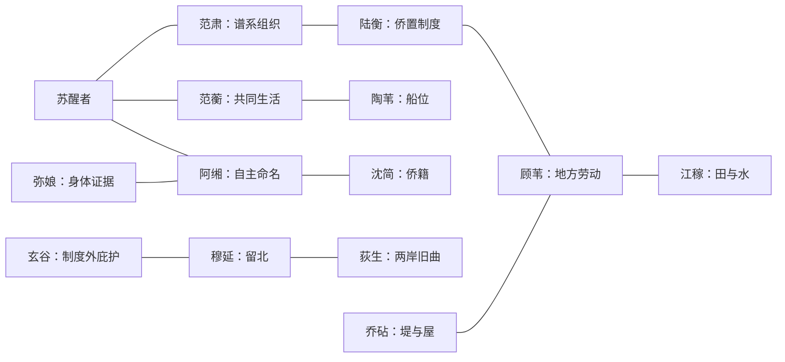

# 第三章《裂土与风骨》人物关系表 V0.1

> 人物原则：北来者、留北者和江南旧民都拥有自己的生活与利益；任何一方都不是文明、野蛮或故乡的唯一代表。

## 1. 核心人物

| ID | 人物 | 公开身份 | 私人欲望 | 盲点 | 柔软处 | 固定行动 |
|---|---|---|---|---|---|---|
| CH03-CHAR-001 | 范蘅 | 苏醒者本世姐姐，掌家与织作 | 把共同生活者都带走，不只带族谱有名者 | 把承担一切当成不必征求别人意见 | 收藏每个失散者衣角 | 偷改一次出城名单 |
| CH03-CHAR-002 | 范肃 | 本家主事者 | 保住家族名望和组织力 | 把家族存续当作所有人的共同利益 | 亲手教家中仆役子弟识字 | 优先带谱内家户南渡 |
| CH03-CHAR-003 | 阿缃 | 无完整旧籍的邻户少女 | 不再以“附入范氏”获得位置 | 拒绝帮助时也拒绝可靠联盟 | 记得每个同行人的口音 | 亲手决定是否附籍、另籍或无籍 |
| CH03-CHAR-004 | 顾苇 | 蒲浦旧村水利主事者 | 让旧村劳动不被北来名望抹去 | 把所有侨人都看成暂住者 | 每年记下修堤伤者家属 | 决堤时先开公共仓 |
| CH03-CHAR-005 | 陶苇 | 船户与渡口组织者 | 让渡船不被任何一方永久征走 | 用价格替代公开拒绝 | 给无钱孩童留最轻的船位 | 船位不足时拒绝范肃包船 |
| CH03-CHAR-006 | 沈简 | 北来书吏，后参与侨籍 | 写出既能获承认又不删掉异议的册 | 相信格式能容纳所有人生 | 保留每种口音的自报名写法 | 私存一份渡江原簿 |
| CH03-CHAR-007 | 弥娘 | 迁徙队医者 | 让疫病不成为驱逐无籍者的借口 | 低估地方居民对资源耗尽的恐惧 | 用不同结法标记病者去向 | 拒绝按侨籍土籍分诊 |
| CH03-CHAR-008 | 穆延 | 北地军户出身的护队者 | 证明留北并不等于无耻或失节 | 把武力保护当作获得资源的资格 | 替死者修复随身小物 | 最终留北或返回北地送信 |
| CH03-CHAR-009 | 荻生 | 乐人与口述记录者 | 让南北两版旧曲不必争唯一正统 | 以为并列版本就能消除身份争夺 | 能模仿每个失散者最后一次呼喊 | 灾中用口音和曲调寻人 |
| CH03-CHAR-010 | 乔砧 | 木石与水工匠人 | 造一处北来旧民都能依靠的堤与屋 | 只重实际贡献，轻视情感故乡 | 在每段堤内藏施工者小木签 | 决堤时主张拆本家大屋取材 |
| CH03-CHAR-011 | 江稼 | 蒲浦农户 | 守住水权、祖坟与孩子的田 | 将新来者等同未来夺地者 | 把最好种子分给真正下田者 | 与阿缃共同种一块争议地 |
| CH03-CHAR-012 | 陆衡 | 地方属官与谋议者 | 让侨旧合作成为可长期运行的制度 | 把有组织家族当作天然代表 | 保存未采用安置方案 | 拟定侨籍土籍并列表 |
| CH03-CHAR-013 | 玄谷 | 坞壁与山地庇护者 | 让无籍者有不依附大族的活路 | 封闭聚落后制造新的排斥 | 为离开者保留一条不问来处的路 | 水灾时开放高地一次 |

## 2. 九字段补充

| 人物 | 公开原则 | 最深恐惧 | 现实利益 | 自认底线 | 可能跨线 |
|---|---|---|---|---|---|
| 范蘅 | “同锅吃过饭就算一家。” | 自己选错路害死所有人 | 家户、织物、车与亲属信任 | 不丢下伤者 | 偷走别人的船位 |
| 范肃 | “无谱则众散。” | 家族在异乡失去组织力 | 郡望、官位、船粮与婚姻 | 不公开造假谱 | 默许补谱与附会 |
| 阿缃 | “名字由我说。” | 一生成为别人家的附注 | 自主籍贯、劳动与关系 | 不揭发无籍者换位置 | 使用不完全真实的旧籍 |
| 顾苇 | “先问谁修过这段堤。” | 旧村成为自己土地上的客人 | 水权、仓粮、公共役 | 不拒绝真正参与劳动者 | 灾时先救旧村 |
| 沈简 | “不确定也应当有写法。” | 原簿被干净重抄取代 | 书吏位置、资料完整 | 不凭门第补不存在事实 | 为保公共效力删去异议 |
| 穆延 | “守过谁，便对谁有债。” | 留北者被南方替写成死人 | 军伍、家属与道路 | 不杀无兵者 | 强征粮保队伍 |
| 陆衡 | “合作必须能征粮也能分粮。” | 侨旧冲突让地方失控 | 官署、地主与大族支持 | 不整村迁逐 | 牺牲无组织小户 |

## 3. 关系主轴



## 4. 关键关系

- 范蘅与范肃：都要家族活下去，一个按共同生活，一个按谱系。
- 阿缃与沈简：她需要他写，但拒绝让他替她定义；高信任也不能取消自主。
- 顾苇与陆衡：一个要求先看劳动，一个需要可执行分类；两人既合作又防备。
- 穆延与南渡者：他选择留北送信，南方不断把他的沉默误写成死亡或背叛。
- 江稼与阿缃：从争地到共耕，关系可成为伙伴、竞争者、亲密关系或彻底决裂。

## 5. 状态

```text
trust
shared_debt
rift
whereabouts
testimony
carrier
belonging_claim
labor_recognized
autonomy_respected
```

`belonging_claim` 记录人物认为什么构成归属；它可以变化，但不能靠送礼改变。

## 6. 交给第四章

| 人物 | 主要载体 | 唐章可能误读 |
|---|---|---|
| 范蘅 | 衣角结、家户共同簿 | 被归入范氏贤女故事，同行者消失 |
| 范肃 | 谱牒与侨籍申请 | 被当作完整可靠家谱 |
| 阿缃 | 自选双名与附籍批注 | 两名拆成两人 |
| 顾苇 | 水利簿与开仓记录 | 劳动归功于官署或大族 |
| 陶苇 | 渡船号与船位账 | 迁徙被写成士族专船 |
| 沈简 | 渡江原簿 | 重抄后异议栏消失 |
| 弥娘 | 疫簿 | 无籍病者被删 |
| 穆延 | 北地断信与孤碑 | 被写成忠、叛两种单一版本 |
| 荻生 | 两岸旧曲 | 宫廷声称收得古曲正本 |
| 乔砧 | 水图、堤内木签 | 工匠姓名被工程名取代 |
| 江稼 | 种子、水名、共耕契 | 旧村被写成受教化者 |
| 陆衡 | 侨旧并列表 | 被当成完美制度范本 |
| 玄谷 | 高地庇护口述 | 坞壁传说神秘化 |
